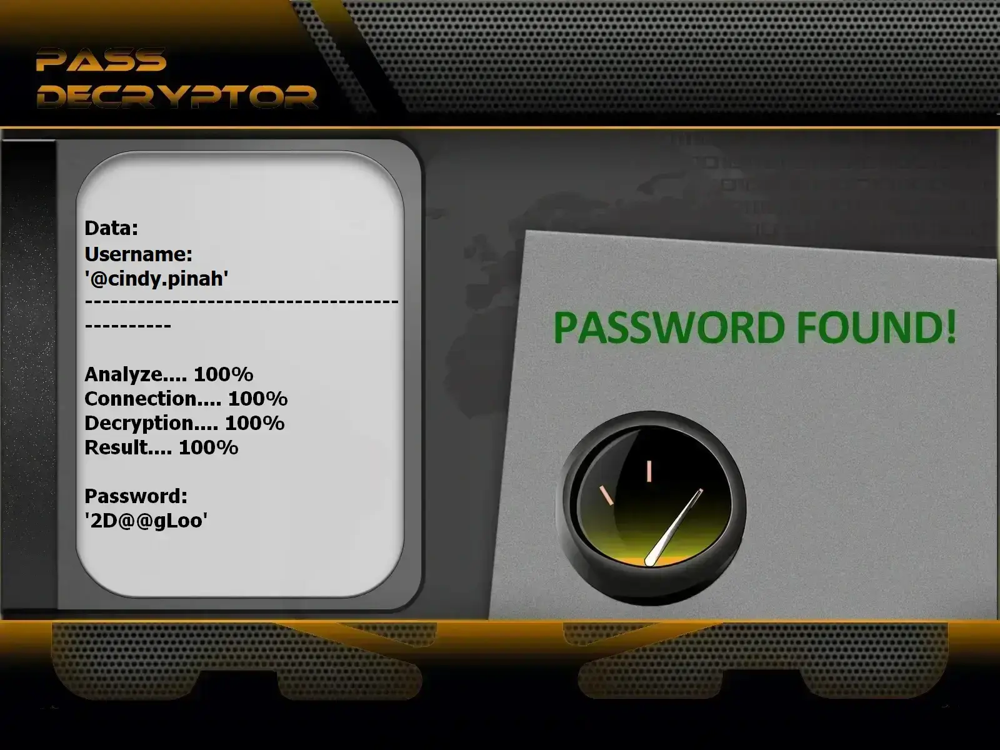

# 🔐 Hack Instagram Password - Security Testing Tool

**Advanced Instagram Password Security Assessment Tool | Educational Use Only**


## ⚠️ IMPORTANT LEGAL DISCLAIMER

**This tool is for EDUCATIONAL and AUTHORIZED SECURITY TESTING purposes ONLY.**

**I used the PASS REVELATOR API, which I thank, to create this program. If you want to learn more about Instagram account security and hacking, I encourage you to visit their website: [https://www.passwordrevelator.net/en/passdecryptor](https://www.passwordrevelator.net/en/passdecryptor)**



* 🚫 **Illegal Use Prohibited**: Unauthorized testing of accounts you don't own is **ILLEGAL**
* ✅ **Authorized Use Only**: Use only on accounts you own or have explicit written permission to test
* 🔒 **Security Awareness**: Designed to demonstrate password vulnerability and promote better security practices
* ⚖️ **Legal Responsibility**: Users are solely responsible for complying with all applicable laws

**By using this tool, you acknowledge that unauthorized access to computer systems is a criminal offense in most jurisdictions.**

## 🎯 Overview

Hack Instagram Password is an advanced security testing tool designed to demonstrate the vulnerabilities of weak passwords and educate users about cybersecurity threats. This tool performs comprehensive password strength testing using multiple attack vectors that real-world hackers employ.

### 🎓 Educational Purpose

* Demonstrate real-world hacking techniques for security awareness
* Test your own account security strength
* Educate about password vulnerability
* Security professional training

## ✨ Features

### 🔑 Multiple Attack Strategies

* **Dictionary Attacks**: Test common passwords and wordlists
* **Mask Attacks**: Pattern-based password generation
* **Combination Attacks**: Word variations with common suffixes
* **Hybrid Attacks**: Combined approaches for maximum coverage

### 🌐 Advanced Anonymity

* **Proxy Rotation**: Automatic proxy switching to avoid detection
* **Tor Integration**: Complete anonymity through Tor network
* **Request Throttling**: Intelligent rate limiting to bypass security
* **User-Agent Rotation**: Mimic real browser behavior

### 📊 Professional Monitoring

* Real-time attack statistics
* Performance metrics and success rates
* Resource usage monitoring
* Detailed reporting and logging

### 🔒 Security Features

* CSRF token handling
* Instagram API compliance
* Encrypted session management
* Automatic CAPTCHA detection

## 🚀 Installation

### Prerequisites

* Python 3.8 or higher
* pip package manager
* Internet connection

### Step 1: Clone Repository

```bash
git clone https://github.com/HoffmannAlex/Hack-Instagram-Account-with-AI
cd hack-Instagram-password
```

### Step 2: Install Dependencies

```bash
pip install -r requirements.txt
```

**Required Packages**

```
text

aiohttp>=3.8.0
requests>=2.28.0
cryptography>=3.4.0
stem>=1.8.0
psutil>=5.9.0
asyncio>=3.9.0
```

### Step 3: Verify Installation

```bash
python hack_Instagram.py --help
```

⚡ Quick Start

**Basic Password Testing**

```bash
python hack_Instagram.py --username your_test_account --password-list passwords.txt
```

**Anonymous Testing with Tor**

```bash
python hack_Instagram.py --username your_test_account --password-list passwords.txt --use-tor
```

**Advanced Multi-threaded Attack**

```bash
python hack_Instagram.py --username your_test_account --password-list passwords.txt --threads 4 --use-tor --min-delay 2 --max-delay 5
```

**Proxy-Based Attack**

```bash
python hack_Instagram.py --username your_test_account --password-list passwords.txt --proxy-list proxies.txt --threads 3
```

## 🔥 Attack Methods

1. Dictionary Attacks

Test passwords from comprehensive wordlists:

```bash
# Using common passwords list
python hack_Instagram.py --username target --password-list common_passwords.txt

# Using customized wordlist
python hack_Instagram.py --username target --password-list custom_list.txt
```

2. Mask Attacks

Pattern-based password generation:

```python
# Example mask patterns:
?l?l?l?d?d?d  # 3 letters + 3 digits (abc123)
?u?l?l?l?d?d  # 1 uppercase + 3 lowercase + 2 digits (Abcd12)
?l?l?l?l?s?d  # 4 letters + 1 special char + 1 digit (abcd!1)
```

3. Combination Attacks

Intelligent password variations:

```bash
# Base words with common modifications
python hack_Instagram.py --username target --strategy combination --base-words "password,admin,user"
```

4. Brute Force Attacks

Complete character set testing (use with caution):

```bash
# Not recommended for production - educational only
python hack_Instagram.py --username target --strategy brute --min-length 4 --max-length 8
```

```bash
python hack_instagram.py --username your_test_account --password-list passwords.txt
```

**Anonymous Testing with Tor**

```bash
python hack_instagram.py --username your_test_account --password-list passwords.txt --use-tor
```

**Advanced Multi-threaded Attack**

```bash
python hack_instagram.py --username your_test_account --password-list passwords.txt --threads 4 --use-tor --min-delay 2 --max-delay 5
```

**Proxy-Based Attack**

```bash
python hack_instagram.py --username your_test_account --password-list passwords.txt --proxy-list proxies.txt --threads 3
```

## 🔥 Attack Methods

1. Dictionary Attacks

Test passwords from comprehensive wordlists:

```bash
# Using common passwords list
python hack_instagram.py --username target --password-list common_passwords.txt

# Using customized wordlist
python hack_instagram.py --username target --password-list custom_list.txt
```

2. Mask Attacks

Pattern-based password generation:

```bash
# Example mask patterns:
?l?l?l?d?d?d  # 3 letters + 3 digits (abc123)
?u?l?l?l?d?d  # 1 uppercase + 3 lowercase + 2 digits (Abcd12)
?l?l?l?l?s?d  # 4 letters + 1 special char + 1 digit (abcd!1)
```

3. Combination Attacks

Intelligent password variations:

```bash
# Base words with common modifications
python hack_instagram.py --username target --strategy combination --base-words "password,admin,user"
```

4. Brute Force Attacks

Complete character set testing (use with caution):

```bash
# Not recommended for production - educational only
python hack_instagram.py --username target --strategy brute --min-length 4 --max-length 8
```
